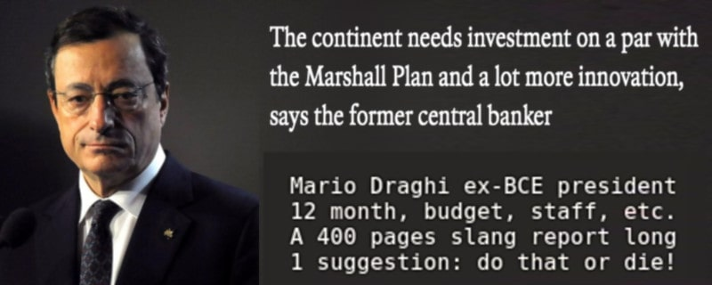
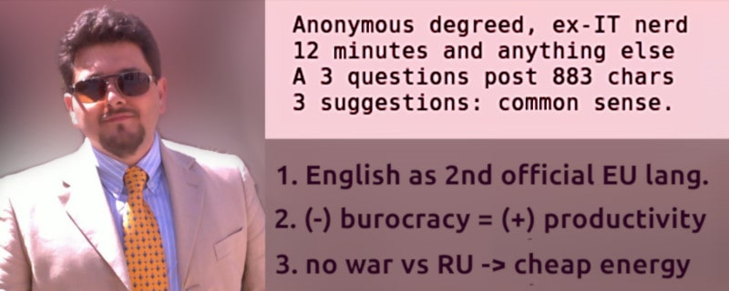

<!--// div align="center">

## Draghi's report about energy

Mario Draghi's 400 pages report to European Commission, about competitiveness.

...

### Q&A DIALOG

In this case, it is not a single prompt but a dialog: a series of answered questions about the uploaded image and the text written on it. Prompts are highlighted and presented written in italic font. Few missing words have been added in the prompt queries just to help the English native speakers to quickly grab the meaning but for sake of correctness those words appear between [squared] parentheses.

### UPLOAD

* [draghi-report-vs-ciuchino-meme.png](draghi-report-vs-ciuchino-meme.png)

A 1700 x 1296 pixels image saved in PNG format in a 1.5 Mb file.

 
 

### CUSTOMISATION

None, publicly web-available chatbot questioned in a new-from-scratch session without any previous custom pre-training.

++++
### COPYRIGHT

&copy; 2024, **Roberto A. Foglietta** &lt;roberto.foglietta@gmail.com&gt;

This document is entirely published under *Creative Commons Attribution Non-Commercial No-Derivatives 4.0 International* license terms ([CC BY-NC-ND 4.0](https://creativecommons.org/licenses/by-nc-nd/4.0/)) included the part above this statement. Moreover, if a version of this document exists or has existed under different licence terms, the licence terms of the latest version available on `github/robang74` [repository](https://github.com/robang74/chatgpt-answered-prompts/) apply. Even when the new licence terms are more restrictive, because permissions for any free content may be revoked at any time at the will of the author, and updating a licence to be more restrictive explicitly implies this will.

...
+

### Prompt #1

This image is divided into two parts one in black (above) and the other in pink (below).Both parts are depicting two men dressed in suits, on the left. Instead, on the right there is a box also divided into two halves (above and below) in which with a two very short texts are presenting their respective efforts in performing a task and the results obtained. Both men offer suggestions that are shown above the box and below the box.

This picture contains a very high density of information and before proceeding to the next question I want to make a more extensive and understandable description of its content and this description should catch and explain the original meaning as much as possible.

---

### Claude 3.5 Sonnet

I understand you'd like a more comprehensive description of the image before proceeding to further questions. I'll break down the content and explain its apparent meaning:

The image is divided into two contrasting sections, seemingly comparing the approaches of two different individuals to addressing European economic and policy issues.

#### Upper section (black background):

- Shows a man in a dark suit and tie, with a serious expression. The text identifies him as Mario Draghi, former president of the European Central Bank (BCE).

- The headline states: "The continent needs investment on a par with the Marshall Plan and a lot more innovation, says the former central banker"

- It describes Draghi's effort as: "12 month, budget, staff, etc. A 400 pages slang report long"

- His single suggestion is dramatically phrased as: "1 suggestion: do that or die!"

#### Lower section (pink background):

- Features a man in a light-colored suit and tie, wearing sunglasses, with a more casual appearance.

- He's described as: "Anonymous degreed, ex-IT nerd"

- His effort is described as: "12 minutes and anything else, A 3 questions post 883 chars"

- He offers "3 suggestions: common sense."

#### The anonymous individual's specific suggestions are listed:

1. English as 2nd official EU lang.

2. (-) burocracy = (+) productivity

3. no war vs RU -> cheap energy

The image appears to be contrasting a lengthy, formal approach to EU economic policy (represented by Draghi) with a quicker, more direct approach focused on practical changes (represented by the anonymous ex-IT professional). It seems to be advocating for simpler, more common-sense solutions to European issues, possibly critiquing the complexity and formality of traditional policy-making processes.

+

### Prompt #2

The IT man['s] suggestions are presented in a language that mimic[s] the math or a sort of programming language. Rewrite that [those] 3 sentence[s] in plain English but keeping the original meaning.

---

### Claude #2

You're right, and I apologize for not addressing that aspect in my initial description. Let me rephrase those three suggestions in plain English while maintaining their original meaning:

1. Make English the second official language of the European Union.

2. Reducing bureaucracy will lead to increased productivity.

3. Avoiding conflict with Russia will result in cheaper energy costs.

These statements simplify complex policy ideas into concise, straightforward proposals, reflecting the "common sense" approach the image attributes to the ex-IT professional. The format mimics programming or mathematical notation to emphasize directness and efficiency, contrasting with the more elaborate approach described for the former central banker.

+

### Prompt #3

Provide an evaluation based on the effort / result ratio between the two performers depicted in that image. Keep the evaluation description as brief as possible but explain the most relevant metric adopted for providing it.

---

### Claude #3

Evaluation based on effort/result ratio:

- The ex-IT nerd significantly outperforms the former central banker.

**Key metric**: Information density per time invested

- Ex-IT nerd: 3 actionable suggestions in 12 minutes

- Former banker: 1 vague suggestion in 12 months

The ex-IT nerd delivers concise, specific proposals in a fraction of the time, resulting in a much higher efficiency ratio. This comparison emphasizes rapid, practical problem-solving over lengthy, resource-intensive processes.

+++++

### Prompt #4

Do the same considering that the outputs are 400 pages versus 883 chars text long. These lengths are fair because both men used their own slang to express their opinions.

---

### Claude #4

Revised evaluation based on effort/result ratio:

- The comparison is less straightforward when considering output volume.

**Key metric**: Actionable suggestions per unit of output

- Former banker: 1 suggestion / 400 pages

- Ex-IT nerd: 3 suggestions / 883 characters

While the banker produces more content, the IT nerd offers more discrete, actionable ideas in a significantly condensed format. The IT nerd's approach yields a higher density of practical proposals per unit of output.

However, this comparison doesn't account for potential depth or complexity in the banker's report. The brevity of the IT nerd's suggestions may oversimplify complex issues, while the banker's lengthy report could contain more nuanced analysis.

+

## Counter check

Please note that in this Q&A dialog the exact same questions asked to Claude have been being asked to ChatGPT but due to a different and more insightful ability to catch the meaning and describe it, just two questions were needed, instead of four. Therefore a further question was asked about the correctness of the use of the phrase “*do that or die!*” referring to Mario Draghi in the uploaded image.

+

### Prompt #1

This image is divided into two parts one in black (above) and the other in pink (below). Both parts are depicting two men dressed in suits, on the left. Instead, on the right there is a box also divided into two halves (above and below) in which with a two very short texts are presenting their respective efforts in performing a task and the results obtained.

Both men offer suggestions that are shown above the box and below the box. This picture contains a very high density of information and before proceeding to the next question I want to make a more extensive and understandable description of its content and this description should catch and explain the original meaning as much as possible.

---

### ChatGPT 4o

This image presents a comparison between two individuals, Mario Draghi, the former president of the European Central Bank (ECB), and an anonymous person described as an "ex-IT nerd." The overall theme of the image contrasts their approaches to addressing large-scale issues facing Europe, particularly economic and political ones.

#### Upper Portion (Black Background) - Mario Draghi

1. **Image**: Mario Draghi, dressed in a dark suit, stands on the left side. He is well-known for his role as the president of the European Central Bank (ECB), which is suggested in the text next to him.
   
2. **Text (Right side)**

   - "The continent needs investment on a par with the Marshall Plan and a lot more innovation, says the former central banker."

     - **Interpretation**: Draghi is calling for substantial investment and innovation, comparing the need to the historic Marshall Plan, which helped rebuild Europe after World War II.
   
   - "Mario Draghi ex-BCE president. 12 month, budget, staff, etc. A 400 pages slang report long. 1 suggestion: do that or die!"

     - **Interpretation**: This part humorously highlights the bureaucratic and formal approach taken by Mario Draghi and his team, emphasizing a lengthy 400-page report, with the final outcome boiling down to a single strong suggestion: "do that or die!" suggesting the high stakes and formality involved in his recommendations.

#### Lower Portion (Pink Background) - Anonymous IT Nerd

1. **Image**: A man in a light-colored suit and sunglasses is presented in a more relaxed pose compared to Mario Draghi, suggesting an informal, perhaps satirical tone.
   
2. **Text (Right side)**

   - "Anonymous degreed, ex-IT nerd. 12 minutes and anything else. A 3 questions post 883 chars. 3 suggestions: common sense."

     - **Interpretation**: This text humorously contrasts the more casual approach of an "anonymous" individual who takes only 12 minutes (compared to Draghi's extensive process) to come up with simple, "common sense" solutions. This person uses a much shorter post (883 characters versus 400 pages) to address the same issues, emphasizing simplicity and practicality over bureaucracy.

3. **The Anonymous Person’s 3 Suggestions (Bottom)**

   - `1. English as 2nd official EU language.`

     - Suggesting that English should be established as the second official language of the European Union.
   
   - `2. (-) bureaucracy = (+) productivity.`

     - Suggesting that reducing bureaucracy will increase productivity.
   
   - `3. no war vs RU -> cheap energy.`

     - Suggesting that avoiding conflict with Russia would lead to cheaper energy, presumably by maintaining access to Russian energy supplies.

#### Overall Meaning

The image is a humorous juxtaposition of two approaches to problem-solving. Mario Draghi represents the formal, bureaucratic, and lengthy process of institutional decision-making, while the anonymous ex-IT nerd represents a quicker, more direct, and practical approach. The contrast points out how sometimes simplicity and common sense can offer clear solutions, whereas formal processes might overcomplicate matters.

This meme conveys the message that institutional and bureaucratic processes, while thorough, can be inefficient compared to straightforward, common-sense solutions.

+

### Prompt #2

Provide an evaluation based on the effort / result ratio between the two performers depicted in that image. Keep the evaluation description as brief as possible but explain the most relevant metric adopted for providing it.

---

### ChatGPT #2

The effort/result ratio between the two performers is starkly different:

- **Mario Draghi (High Effort, Limited Result)**: Draghi’s process involved extensive bureaucracy (12 months, large budget, and a 400-page report) to produce a single directive. His high effort led to a complex, long-term strategy that may provide substantial results but lacks immediacy.

- **Anonymous Ex-IT Nerd (Low Effort, Practical Result)**: In contrast, the anonymous person used minimal effort (12 minutes, 883 characters) to suggest three practical solutions grounded in common sense. The low-effort approach produced clear, actionable ideas quickly.

- **Metric: Efficiency of Input vs. Output**: The ex-IT nerd's approach offers a significantly better effort/result ratio due to quick, actionable insights with minimal resources, compared to Draghi’s more formal but labor-intensive process.

Ultimately, the IT nerd's approach appears more efficient in generating concise, actionable ideas, but may lack the comprehensive analysis presumably present in the banker's report.

+

### Prompt #3

Considering that Mario Draghi was the Italian Prime Minister during the Covid-19 pandemic and a that time speaking at an official press conference he said, in Italian: "chi non si vaccina muore e fa morire" - avoid any considerations about vaccines, covid, pandemic, etc. - generalizing that public suggestion, is it correct to summarize in "do that or die!"?

---

### ChatGPT #3

Yes, it is reasonable to summarize Mario Draghi's statement, "chi non si vaccina muore e fa morire" (which translates to "those who don't get vaccinated die and cause others to die"), as "do that or die!" in a generalized, non-specific context. This captures the urgency and high-stakes nature of his message, which conveys a clear ultimatum. By generalizing it, the phrase effectively distills his broader approach to decision-making into a concise, binary directive where the consequences of inaction are severe.

+

## Considerations

First of all, this meme image is clearly comprehensible also for a chatbot even if Mistral 2 Large failed in this task probably because of an improvable OCR engine. Which is a fundamental assessment because it states that 2 over 3 chatbots can correctly and quickly interpret that meme. So, the image is a dumb proof meme, almost.

Second, with the extra question asked to ChatGPT about "do that or die!", it has been assessed that it is a fair translation of the directive attitude shown in front of the press when Mario Draghi was on Italian Prime Minister role, in particular about taking vaccine-shoot or the consequences.

Third, asking about performances throughput about the two men performances, both the chatbots were strongly in favor of the IT man. When specifically triggered about the length of the outputs, they correctly stated that in 400 pages, it could reside much more value and insights.

Finally, the Mario Draghi report has been previously challenged leveraging a similar approach based on AI. In particular, thanks to an Italian Microsoft professional that created a specifically Draghi's report pre-trained ChatGPT 4o agent. Hence, also the report content has been evaluated about two different aspects:

* [Draghi's report about energy](Draghi-report-about-energy-01.md)

* [Draghi's report about innovation](Draghi-report-about-innovation-01.md)

These two aspects can be seen as external/internal perspectives:

- geopolitical foreign posture and in particular independence by USA presidency

- the European internal political approach and in particular system vs people

Which makes sense because, all in all, the main difference in this confrontation is about seeing European Union as a bureaucratic institution subjugated by the US presidency agenda or, alternatively, as an independent union, and possibly a Swiss-like federation, of various and different states which have agreed about some common rules and rights in order to empower European citizenship as a key asset of freedom and wealth.

+

## Share alike

&copy; 2024, **Roberto A. Foglietta** &lt;roberto.foglietta@gmail.com&gt;, [CC BY-NC-ND 4.0](https://creativecommons.org/licenses/by-nc-nd/4.0/)

