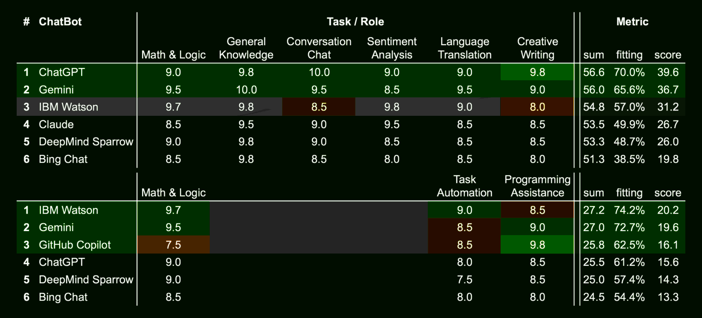

 
 

## Q&A dialogs with AI chatbots

A collection of some Q&A dialogs with various AI powered chatbots about different subjects which get the attention of the media.

#### Website

* [robang74.github.io/chatgpt-answered-prompts](https://robang74.github.io/chatgpt-answered-prompts)

#### Related

* [Chatbots for Fun (humor!)](https://github.com/robang74/chatbots-for-fun?tab=readme-ov-file#chatbots-for-fun) (2024-11-17)

* [Roberto A. Foglietta (blog)](https://robang74.github.io/roberto-a-foglietta) source on [github](https://github.com/robang74/roberto-a-foglietta) (2024-12-14)

 

## Warnings

Few but relevant warnings for those are not aware how artificial intelligence and chatbots are working under the hood. Just to say that these are very powerful tools that can achieve some impressive results. However, like most of the IT tools, they are not trivial to use and to trust. Here below are some tips to grasp the essential concepts, limits and opportunities.

#### please, notice this

* I wrote these papers and published them on a github repository in order to track their changes and evolution. Often, I wrote them using the AI as a critical argumentative partner or a peer-review or an antagonist counter-speaker, for example.

* These roles-playing are well-know in the literature as "*co-competition*", "*antagonist collaboration*", "*adversarial team working*", "*ideas funneling*", "*serendipity brainstorming*", "*fair-play antagonism*" and "*explain to understand*" which is "*learning by doing*" but declined in idea development and refinement area.

* Hence, these papers were NOT written by the AI,  instead the chatbot had a mere assistant role, whatever it was, allowing me to better understand how to explain my idea. Like it was an advanced text editor!

#### mostly LLM, almost AI

* The chatbot is not exactly artificial intelligence but specifically **LLM** which is an acronym of **Large Language Models**. On top of that, techies put some more features like the ability to browse the internet, querying databases, do math, write text, code and documentation formatting, etc. Specific skills have been added on the top of a LLM engine (like ChatGPT or DALL-E) and these models are HUGE not only in terms of parameters (knowledge or rules ability to learn) but also in terms of architectural design like Mistral AI.

* Therefore, for those started to get their hands dirty at that time in which AI was named "*neural network*" or in some more humile but specific terms like "*perceptron*" or "*data classifier*" or "*patter reconignisation*" or in more generic terms "*linear algebra*" with "*step functions*" or "*S-like functions*" or "*activation functions*", this topic and the advancement are exiting. For all the others, AI is a purely marketing definition which mostly means **LLM** but they should read it as **Largely Limited Mind\ness** and wonder why that `\` in their alternative definition instead of any other bar-like character.

#### please, avoid this

* Stop expecting that the AI would give you a useful answer or even a wise answer. The correct use of an AI, it is not querying it as it were the [Delphi's Oracle](https://en.wikipedia.org/wiki/Pythia), an ancient Greek myth, but as a tool to avoid asking real-living people doing {dumb, boring, repeating} tasks.

* Very skilled people can use the AI also for peer-reviewing a paper, playing a role in a conversation, etc. Those who are also experienced know that the AI is usually failing to summarize a text because it is not even able to identify the concepts expressed in that text that is worth being noticed.

* In fact, the more that ideas are far from the obvious (common-sense vs insightful wisdom) , the more they are statistically left behind by the LLM. And also humans do the same, by the way. Which means that unless a specific pre-training, without a skilled and without  an experienced human driving the chatbot, the AI is just an advanced "*fortune cookies*" messages provider.

#### be classic, or else

* In case you wish not abandon your habit to decide or act on driven by random inputs also known as "*the art of divination*" or "*ghosts' suggestion*", then using the "*traditional*" tools - like reading cards, tea spots in the tea cup, fractal images in coffee grounds, arbitrary recognition of structures in animal entrails - is way lesser energy intensive approach with grants you even better results. Be traditional!

 

## Index about finance & economics

1. **Draghi's report about innovation** [[**`md`**](Draghi-report-about-innovation-01.md)] [[**`html`**](html/Draghi-report-about-innovation-01.html)] [[**`pdf`**](pdf/Draghi-report-about-innovation-01.pdf)]

   - Focuses on Draghi’s stance on promoting innovation in Europe, highlighting the importance of technological advancement for economic growth.

3. **Draghi's report about energy** [[**`md`**](Draghi-report-about-energy-01.md)] [[**`html`**](html/Draghi-report-about-energy-01.html)] [[**`pdf`**](pdf/Draghi-report-about-energy-01.pdf)]

    - Covers Mario Draghi's report on Europe's energy policies, focusing on transitioning to sustainable and renewable energy sources.

4. **Draghi's faboulous 800bln funding plan** [[**`md`**](Draghi-faboulous-800bln-funding-02.md)] [[**`html`**](html/Draghi-faboulous-800bln-funding-02.html)] [[**`pdf`**](pdf/Draghi-faboulous-800bln-funding-02.pdf)]

    - Discusses Mario Draghi's proposed €800 billion funding initiative aimed at boosting Europe's economic recovery.

5. **Draghi's report vs Ciuchino meme** [[**`md`**](Draghi-report-vs-ciuchino-meme.md)] [[**`html`**](html/Draghi-report-vs-ciuchino-meme.html)] [[**`pdf`**](pdf/Draghi-report-vs-ciuchino-meme.pdf)]

    - Analyzes the viral "Ciuchino" meme and its criticism of Mario Draghi's policies, juxtaposing humor with political commentary.

6. **Paper money is financial communism** [[**`md`**](paper-money-financial-communism-03.md)] [[**`html`**](html/paper-money-financial-communism-03.html)] [[**`pdf`**](pdf/paper-money-financial-communism-03.pdf)]

    - Explores the concept of financial communism and paper money, discussing its implications on modern economic systems and wealth distribution.

7. **Quantitative easing is drug addiction** [[**`md`**](quantitative-easing-drug-addiction-01.md)] [[**`html`**](html/quantitative-easing-drug-addiction-01.html)] [[**`pdf`**](pdf/quantitative-easing-drug-addiction-01.pdf)]

    - Explores the concept of addiction generated by a dystopic financial based on a constant monetary inflation to cope with sovereign debts.

8. **Valutazione di un nuovo modello monetario** [[**`md`**](valutazione-di-un-nuovo-modello-monetario.md)] [[**`html`**](html/valutazione-di-un-nuovo-modello-monetario.html)] [[**`pdf`**](pdf/valutazione-di-un-nuovo-modello-monetario.pdf)]

    - How to globally escape from the current dystopic financial model and connect the economics with reality, avoid WW3 and save the planet.

 

## Index about education & innovation

1. **Propaganda e sistema educativo** [[**`md`**](propaganda-e-sistema-educativo.md)] [[**`html`**](html/propaganda-e-sistema-educativo.html)] [[**`pdf`**](pdf/propaganda-e-sistema-educativo.pdf)]

    - Why are common people so easy to trick into propaganda narrative? This article is going to propose an analytic answer to this question.

2. **The imprinting role in the mass education** [[**`md`**](the-imprinting-role-in-the-mass-education.md)] [[**`html`**](html/the-imprinting-role-in-the-mass-education.html)] [[**`pdf`**](pdf/the-imprinting-role-in-the-mass-education.pdf)]

    - The imprinting phenomena has been discovered in animals, in the first place. However, the mass education system created after the Industrial Revolution does the same.

3. **artificial Intelligence for education** [[**`md`**](artificial-intellige-for-education.md)] [[**`html`**](html/artificial-intellige-for-education.html)] [[**`pdf`**](pdf/artificial-intellige-for-education.pdf)]

    - How to leverage Artificial Intelligence for supporting a new mass education system which prioritizes critical thinking, the non-violence and ethics.

4. **Dalla supercazzola alla civiltà** [[**`md`**](dalla-supercazzola-alla-civita.md)] [[**`html`**](html/dalla-supercazzola-alla-civita.html)] [[**`pdf`**](pdf/dalla-supercazzola-alla-civita.pdf)]

    - A great idea without a good implementation is useless. Hence, this article presents a viable implementation path that has already proven to work in the real world.

5. **Se la verità li uccide, lasciate che muoiano** [[**`md`**](se-la-verita-li-uccide-lasciate-che-muoiano.md)] [[**`html`**](html/se-la-verita-li-uccide-lasciate-che-muoiano.html)] [[**`pdf`**](pdf/se-la-verita-li-uccide-lasciate-che-muoiano.pdf)]

    - Starting from an contro-meme challenge about a citation popularly attributed to Immanuel Kant toward a rule of thumb how to deal with the lies, the truth and their expectations.

 

## Download

There are several way to download this github repository:

- using the green button in its homepage and download the [last archive](https://github.com/robang74/chatgpt-answered-prompts/archive/refs/heads/main.zip)

or

- choose a tagged release among [those available](https://github.com/robang74/chatgpt-answered-prompts/tags) and download that archive

or

- clone the repository with the specific `git clone` command, in this way:

> `git clone https://github.com/robang74/chatgpt-answered-prompts.git`

The advantage of downloading a tagged release is having an archive 'freezed' by
the author while the ZIP contains the last version uploaded. Instead, the
`git clone` will also provide you with all the information and a complete view
of every change. Click on the link above will submit the related request for you.

 

## Versioning

One of main goals of `git` and the github web interface is to provide a versioning
control which also means a catalog of every author and changes made by them on
every single file. The list of these changes are named *commits*. Here below the link
related to the commits pushed on this repository:

* https://github.com/robang74/chatgpt-answered-prompts/commits/main/

As you can see, each commit is carry-on a time stamp also. The green label indicates
that also the timestamp is validate by the github infrastructure system which belongs
to Microsoft Corporation. In fact, github cannot validate those timestamps that are
coming from 3rd party systems like the users workstations but just the receiving
time, date and content. However, for most of the cases this is irrelevant.

 

## Translations

The aim is to provide translations of these .md files in different languages. The translations will be put into a subfolder with the English name of the language in which they have been translated into. The translated .md file will carry a section about how the translation has been made. 

Here below a template in English:

> This document (tag: `$tagstring` or hash: `$hashstring`) has been translated from English into `$language` by a native `$language` speaker who knows English and with the support of `$automatic-tool` to speed up the translation task.

As you can see the translated document should contain a reference about the original version and those which are tagged are the most reliable.

If you wish to send a translation, it is necessary that you know well one of the languages in which this document is available, even better if you know English and can start from the original version, and that you are a native speaker or equivalent in the language in which the translation is being made.

 

## AI chatbots

This table was produced by having ChatGPT interact with Gemini in such a way that they freely and progressively agreed on the evaluation of different chatbots. In this context 10.0 means the best available at the moment (2024-12-19).

 

Both chatbots changed their ratings by a total of 18% and 19%. However, in some, albeit a few cases, they changed their opinion completely, changing their grades by 7 or 5 points out of 10. Both relied on [Chatbot Arena](https://lmarena.ai/) LLM Leaderboard, also.

 

## Copyright

&copy; 2024, **Roberto A. Foglietta** \<roberto.foglietta@gmail.com\>

All the files in this gihub repository are published *Creative Commons Attribution Non-Commercial No-Derivatives 4.0 International* license terms ([CC BY-NC-ND 4.0](https://creativecommons.org/licenses/by-nc-nd/4.0/)), unless states differently or not applicable due to a different and previous authorship.

Moreover, if a version of a document included in this repository exists or has existed under different licence terms, the licence terms of the latest version available on `github/robang74` [repository](https://github.com/robang74/chatgpt-answered-prompts/) apply. Even when the new licence terms are more restrictive, because permissions for any free content may be revoked at any time at the will of the author, and updating a licence to be more restrictive explicitly implies this will.

