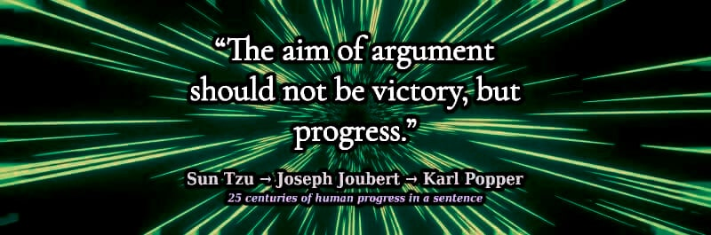

## Dalla supercazzola alla civiltà

Questa conversazione è la prosecuzione di queste conversazioni ma con il chatbot basato su Mistral AI.

* [L'arte della supercazzola](https://github.com/robang74/chatbots-for-fun/blob/main/l-arte-della-supercazzola.md)

* [Propaganda e sistema educativo](propaganda-e-sistema-educativo.md)

* [Artificial Intelligence for education](artificial-intellige-for-education.md)

Le quali a loro volta sono collegate a queste conversazioni:

* [ChatGPT vs human real reasoning](https://github.com/robang74/chatbots-for-fun/blob/main/chatgpt-vs-human-real-reasoning.md)

* [The imprinting role in the mass education](the-imprinting-role-in-the-mass-education.md)

 
 

### Prompt #1

Non voglio che tu faccia un riassunto di questo testo in upload 

* [L'arte della supercazzola](https://github.com/robang74/chatbots-for-fun/blob/main/l-arte-della-supercazzola.md)

ma che svolga i seguenti compiti a partire dal suo contenuto:

1. tracciare la linea di ragionamento secondo i vari passaggi con un lista di frasi o brevi periodi;

2. commentare con un breve periodo questa linea di ragionamento e poi elencare gli eventuali aspetti positivi e gli eventuali aspetti negativi;

3. scrivere una conclusione che riassuma - non il testo - ma il punto di arrivo del ragionamento rispetto al contenuto del dialogo e poi di questa conclusione elencare gli eventuali aspetti positivi e gli eventuali aspetti negativi;

Se ritieni di aver bisogno di aiuto per interpretare questo prompt o il testo, fermati e chiedi pure, se lo ritieni importante altrimenti procedi secondo quanto ritieni corretto.

---

### Mistral #1

#### 1. Linea di Ragionamento

1. **Definizione e Traduzione della Supercazzola**:
   - Discussione sulla migliore traduzione in inglese del termine "fare la supercazzola" in stile "Amici Miei".
   - Proposte di traduzioni come "gobbledygook", "nonsense", "hot air", "bullshit".

2. **Analisi delle Proposte di Traduzione**:
   - Valutazione delle varie opzioni di traduzione in base al contesto e all'effetto desiderato.
   - Considerazione di creare un neologismo come "to supercazzola".

3. **Valutazione di "Razzle-dazzle Trolling Joke"**:
   - Analisi della proposta "razzle-dazzle trolling joke" come traduzione.
   - Valutazione dei punti di forza e delle possibili migliorie.

4. **Significato della Supercazzola nello Spirito Goliardico**:
   - Discussione sul ruolo della supercazzola come gioco relazionale e sociale.
   - Analisi della scena del rimprovero del Conte Mascetti come esempio di dinamica sociale.

5. **Supercazzola come Pilastro della Diplomazia**:
   - Affermazione che la supercazzola può essere vista come un pilastro della diplomazia.
   - Analisi del ruolo della supercazzola nel mantenere il dialogo e neutralizzare la tensione.

6. **Differenza tra Politica e Diplomazia**:
   - Discussione sulla differenza tra politica (orientata al breve termine) e diplomazia (orientata al lungo termine).
   - Ruolo limitato della supercazzola in politica rispetto alla diplomazia.

7. **Supercazzola come Ponte Effimero ma Necessario**:
   - Definizione della supercazzola come un ponte effimero ma necessario.
   - Analisi del concetto di "optimistic faith" e "fede nell'ottimismo".

8. **Supercazzola come Strumento di Alleggerimento**:
   - Ruolo della supercazzola nel distogliere dal confronto radicale e alleggerire la serietà delle divergenze.
   - Analisi del valore umanizzante della supercazzola.

9. **Filosofia Buddista nell'Educazione**:
   - Discussione sull'integrazione di una filosofia ispirata al Buddismo nell'educazione scolastica.
   - Ruolo del Karma e della non-violenza nel fornire strumenti ottimistici e ponderati.

10. **Conclusione con Citazione di Vasco Rossi**:
    - Conclusione del dialogo con la citazione di Vasco Rossi e la metafora della vita come una supercazzola sublime.

#### 2. Commento sulla Linea di Ragionamento

La linea di ragionamento esplora in profondità il concetto di "supercazzola" partendo dalla sua traduzione in inglese fino ad arrivare a una riflessione filosofica e sociale. Il dialogo si sviluppa in modo coerente, passando da considerazioni linguistiche a implicazioni diplomatiche e educative, culminando in una visione ottimistica e ponderata della vita.

**Aspetti Positivi**:
- Profondità dell'analisi.
- Coerenza e fluidità del ragionamento.
- Integrazione di elementi culturali e filosofici.

**Aspetti Negativi**:
- Possibile complessità per chi non è familiare con il contesto culturale italiano.
- Alcune digressioni potrebbero sembrare superflue a chi cerca una risposta diretta.

#### 3. Conclusione

Il punto di arrivo del ragionamento è che la supercazzola, pur essendo un gioco di parole apparentemente frivolo, rappresenta un atto di fiducia ottimistica e un ponte effimero ma necessario per mantenere il dialogo e la relazione umana anche nelle situazioni più difficili. Questa visione si estende alla filosofia buddista e all'educazione, suggerendo che l'integrazione di principi come il Karma e la non-violenza può fornire strumenti ottimistici e ponderati per affrontare la vita.

**Aspetti Positivi**:
- Visione ottimistica e costruttiva della vita.
- Valorizzazione del dialogo e della relazione umana.
- Integrazione di principi filosofici e culturali.

**Aspetti Negativi**:
- Possibile idealizzazione della supercazzola come soluzione universale.
- Rischio di sottovalutare la complessità delle situazioni reali.

 

### Prompt #2

Tralasciamo la supercazzola in quanto molto calata in un contesto culturale ristretto quale quello italiano, e poi perché in fondo parlare della supercazzola era solo una scusa per affrontare temi molto più importanti.

Puoi fornire una risposta diretta alla domanda di trarre una conclusione generale senza la pretesa di essere universale e senza sfociare nell'idealismo? Anche perché la questione dell'idealizzazione è stata trattata a parte (e ne discuteremo in un prompt futuro).

---

### Mistral #2

#### Conclusione Generale

Il dialogo ha esplorato come strumenti apparentemente frivoli o effimeri possano giocare un ruolo cruciale nel mantenere il dialogo e la relazione umana, anche in situazioni di conflitto o difficoltà. La riflessione si è estesa alla diplomazia e all'educazione, suggerendo che principi come la non-violenza e il Karma possono fornire strumenti ottimistici e ponderati per affrontare le sfide della vita.

**Aspetti Positivi**:
- Valorizzazione del dialogo e della relazione umana come mezzi per superare i conflitti.
- Integrazione di principi filosofici e culturali che promuovono la non-violenza e la responsabilità individuale.
- Visione ottimistica ma realistica delle possibilità di costruire un futuro migliore attraverso scelte ponderate e dialogo.

**Aspetti Negativi**:
- Rischio di sottovalutare la complessità e la gravità di alcune situazioni reali.
- Possibile difficoltà nell'applicare questi principi in contesti culturali molto diversi.

Questa conclusione non pretende di essere universale e riconosce la necessità di adattare questi strumenti alle specifiche circostanze e contesti culturali.

 

### Prompt #3

In questo contesto aggiungiamo questo [meme] e questo testo. Pensi che ora gli aspetti negativi siano stati superati?

Sun Tzu ne **L'Arte della Guerra** è scritto che lo scopo della guerra non è vincere, ma creare le condizioni per una pace duratura e, all'inizio di quel saggio, scrisse anche che “*L'arte suprema della guerra è sottomettere il nemico senza combattere*”, affermando chiaramente che non è con la violenza che si può ottenere il meglio. La citazione di Joseph Joubert riporta un concetto quasi identico: “Lo scopo dell'argomentazione non deve essere la vittoria, ma il progresso”.

Inoltre, Karl Popper ha proposto il principio di falsificazione come pilastro portante della scienza, accettando lo stesso concetto: raggiungere il progresso attraverso un confronto costruttivo. È ovvio che qualcuno può decidere in qualsiasi momento di usare la violenza per sottometterci e questo crea l'inevitabile necessità di essere pronti a difenderci. Tuttavia, come affermato da Sun Tzu ed elaborato da altri nei 25 secoli successivi, il modo migliore di agire è usare il cervello in modo intelligente piuttosto che affidarsi solo alla forza bruta.

Infine, vale la pena di notare che Fabrizio De Andrè, già nel 1973, cantava: "*Intellettuali d'oggi idioti di domani ridatemi il cervello che basta alle mie mani*". Ecco qui, quindi!

---

**Nota**: questo testo e questo meme sono stati presi da questa pagina [qui](https://github.com/robang74/roberto-a-foglietta?tab=readme-ov-file#warp-meme).

---

### Mistral #3

#### Conclusione Generale Rivisitata

Il dialogo ha esplorato come strumenti apparentemente frivoli o effimeri possano giocare un ruolo cruciale nel mantenere il dialogo e la relazione umana, anche in situazioni di conflitto o difficoltà. La riflessione si è estesa alla diplomazia e all'educazione, suggerendo che principi come la non-violenza e il Karma possono fornire strumenti ottimistici e ponderati per affrontare le sfide della vita.

Sun Tzu ne **L'Arte della Guerra** scrisse che lo scopo della guerra non è vincere, ma creare le condizioni per una pace duratura. All'inizio di quel saggio, affermò anche che “*L'arte suprema della guerra è sottomettere il nemico senza combattere*”, sottolineando che non è con la violenza che si può ottenere il meglio. La citazione di Joseph Joubert riporta un concetto simile: “Lo scopo dell'argomentazione non deve essere la vittoria, ma il progresso”.

Inoltre, Karl Popper ha proposto il principio di falsificazione come pilastro portante della scienza, accettando lo stesso concetto: raggiungere il progresso attraverso un confronto costruttivo. È ovvio che qualcuno può decidere in qualsiasi momento di usare la violenza per sottometterci, creando l'inevitabile necessità di essere pronti a difenderci. Tuttavia, come affermato da Sun Tzu ed elaborato da altri nei 25 secoli successivi, il modo migliore di agire è usare il cervello in modo intelligente piuttosto che affidarsi solo alla forza bruta.

Infine, vale la pena di notare che Fabrizio De Andrè, già nel 1973, cantava: "*Intellettuali d'oggi idioti di domani ridatemi il cervello che basta alle mie mani*".

**Aspetti Positivi**:
- Valorizzazione del dialogo e della relazione umana come mezzi per superare i conflitti.
- Integrazione di principi filosofici e culturali che promuovono la non-violenza e la responsabilità individuale.
- Visione ottimistica ma realistica delle possibilità di costruire un futuro migliore attraverso scelte ponderate e dialogo.
- Riferimenti storici e filosofici che rafforzano l'idea che il progresso si ottiene attraverso il confronto costruttivo e non la violenza.

**Aspetti Negativi**:
- Rischio di sottovalutare la complessità e la gravità di alcune situazioni reali.
- Possibile difficoltà nell'applicare questi principi in contesti culturali molto diversi.

Con l'aggiunta delle citazioni e dei riferimenti storici, gli aspetti negativi sono stati in gran parte mitigati, fornendo una base più solida e universale alla conclusione.

 

### Prompt #4

Cosa proponi per superare gli aspetti negativi?

---

### Mistral #4

#### Proposte per Superare gli Aspetti Negativi

1. **Educazione e Formazione**:
   - **Integrazione di Principi Filosofici**: Promuovere l'insegnamento di filosofie come il Buddismo, che enfatizzano la non-violenza e il Karma, nelle scuole e nelle istituzioni educative. Questo può aiutare a formare individui più consapevoli e responsabili, capaci di affrontare i conflitti in modo costruttivo.
   - **Programmi di Mediazione e Risoluzione dei Conflitti**: Implementare programmi di formazione sulla mediazione e la risoluzione dei conflitti, sia a livello scolastico che professionale. Questo può fornire strumenti pratici per gestire le divergenze senza ricorrere alla violenza.

2. **Promozione del Dialogo e della Diplomazia**:
   - **Iniziative di Dialogo Interculturale**: Organizzare iniziative e forum di dialogo interculturale per favorire la comprensione reciproca e la collaborazione tra diverse culture. Questo può aiutare a superare le barriere culturali e a trovare soluzioni comuni.
   - **Supporto alla Diplomazia**: Sostenere e finanziare iniziative diplomatiche che promuovono il dialogo e la negoziazione come mezzi per risolvere i conflitti. Questo può includere il supporto a organizzazioni internazionali e ONG che lavorano per la pace e la risoluzione dei conflitti.

3. **Sensibilizzazione e Comunicazione**:
   - **Campagne di Sensibilizzazione**: Lanciare campagne di sensibilizzazione sui benefici del dialogo e della non-violenza, utilizzando mezzi di comunicazione di massa e social media. Questo può aiutare a diffondere una cultura di pace e di risoluzione non violenta dei conflitti.
   - **Storytelling e Esempi Positivi**: Utilizzare storie e esempi positivi di risoluzione non violenta dei conflitti per ispirare e motivare le persone. Questo può includere la diffusione di storie di successo di mediazione e diplomazia.

4. **Ricerca e Innovazione**:
   - **Studi e Ricerche**: Promuovere studi e ricerche sui metodi di risoluzione non violenta dei conflitti e sulla loro efficacia. Questo può fornire dati e prove empiriche che supportano l'uso del dialogo e della diplomazia come strumenti di pace.
   - **Innovazione Tecnologica**: Utilizzare la tecnologia per sviluppare nuovi strumenti e piattaforme che facilitino il dialogo e la mediazione. Questo può includere l'uso di intelligenza artificiale e altre tecnologie avanzate per supportare la risoluzione dei conflitti.

5. **Politiche e Strategie**:
   - **Politiche di Supporto**: Implementare politiche governative che supportino il dialogo e la mediazione come mezzi per risolvere i conflitti. Questo può includere il finanziamento di programmi di formazione e di iniziative di dialogo interculturale.
   - **Strategie di Lungo Termine**: Sviluppare strategie di lungo termine che promuovano una cultura di pace e di risoluzione non violenta dei conflitti. Questo può includere la creazione di piani d'azione nazionali e internazionali per la pace e la sicurezza.

Implementando queste proposte, è possibile superare gli aspetti negativi e promuovere una cultura di dialogo, non-violenza e risoluzione costruttiva dei conflitti.

 

### Prompt #5

Pensi che quanto descritto in questi 2 documenti possa soddisfare alcuni dei punti sopra elencati e in particolare quello dell'educazione che è anche il principale visto che una buona educazione di massa agevola anche il raggiungimento di tutti gli altri?

* [propaganda-e-sistema-educativo.md](propaganda-e-sistema-educativo.md)

* [artificial-intellige-for-education.md](artificial-intellige-for-education.md)

Ignora i link inclusi in questi due documenti.

---

### Mistral #5

#### 1. Linea di Ragionamento

1. **Critica del Sistema Educativo**:
   - Il sistema educativo attuale è criticato per la sua incapacità di promuovere il pensiero critico e razionale.
   - Storici e filosofi hanno da sempre evidenziato i limiti dell'educazione tradizionale.

2. **Evoluzione del Sistema Educativo**:
   - Prima della Rivoluzione Industriale, l'educazione era riservata alle élite e non esisteva un sistema di massa.
   - Con la Rivoluzione Industriale, l'educazione di massa è stata introdotta per formare una forza lavoro disciplinata e istruita.

3. **Critica della Massificazione**:
   - L'educazione di massa ha portato a una standardizzazione che limita la creatività e il pensiero critico.
   - Il sistema educativo moderno è spesso visto come un mezzo per perpetuare lo status quo e limitare il potenziale umano.

4. **Proposte di Miglioramento**:
   - Introduzione di attività pratiche e manuali per sviluppare competenze concrete.
   - Integrazione di giochi di ruolo e teatro per promuovere l'empatia e la comprensione sociale.
   - Scoutismo laico come attività formativa complementare per sviluppare disciplina e autonomia.

5. **Ruolo dell'Intelligenza Artificiale**:
   - L'IA può essere utilizzata per personalizzare l'educazione e supportare l'apprendimento.
   - Tuttavia, l'IA deve essere integrata in modo da non sostituire l'interazione umana e la comprensione del contesto reale.

6. **Educazione e Buddismo**:
   - Il Buddismo è proposto come base filosofica per l'educazione, in quanto promuove l'etica, la non-violenza e la consapevolezza di sé.
   - Un approccio buddista può aiutare a superare le resistenze religiose e culturali verso l'educazione laica e scientifica.

#### 2. Commento sulla Linea di Ragionamento

La linea di ragionamento esplora in profondità le criticità del sistema educativo attuale e propone soluzioni innovative per migliorarlo. La riflessione storica e filosofica arricchisce il dibattito, evidenziando come i problemi attuali affondino le radici in secoli di pratiche educative limitanti. Le proposte di integrazione di attività pratiche, giochi di ruolo e scoutismo laico sono concrete e mirate a sviluppare competenze trasversali essenziali per la crescita personale e professionale.

**Aspetti Positivi**:
- Profondità dell'analisi storica e filosofica.
- Proposte concrete e innovative per migliorare il sistema educativo.
- Integrazione di approcci educativi complementari.

**Aspetti Negativi**:
- La complessità della riflessione potrebbe rendere difficile l'implementazione pratica di alcune proposte.
- La resistenza culturale e religiosa potrebbe ostacolare l'adozione di un approccio buddista nell'educazione.

#### 3. Conclusione

Il punto di arrivo del ragionamento è che un sistema educativo efficace deve promuovere il pensiero critico, la creatività e l'autonomia degli studenti. Questo può essere raggiunto attraverso l'integrazione di attività pratiche, giochi di ruolo, scoutismo laico e l'uso dell'intelligenza artificiale come supporto all'apprendimento. Un approccio educativo basato su principi buddisti può aiutare a superare le resistenze culturali e religiose, promuovendo un'educazione laica, etica e non-violenta.

**Aspetti Positivi**:
- Visione olistica dell'educazione che promuove il pensiero critico e la creatività.
- Integrazione di attività pratiche e giochi di ruolo per sviluppare competenze trasversali.
- Uso dell'intelligenza artificiale come supporto all'apprendimento personalizzato.

**Aspetti Negativi**:
- La complessità delle proposte potrebbe rendere difficile la loro implementazione pratica.
- La resistenza culturale e religiosa potrebbe ostacolare l'adozione di un approccio buddista nell'educazione.

#### Considerazioni Finali

I documenti forniti affrontano in modo approfondito le criticità del sistema educativo attuale e propongono soluzioni innovative per migliorarlo. Le proposte di integrazione di attività pratiche, giochi di ruolo, scoutismo laico e l'uso dell'intelligenza artificiale come supporto all'apprendimento sono concrete e mirate a sviluppare competenze trasversali essenziali per la crescita personale e professionale. Tuttavia, la complessità delle proposte e la resistenza culturale e religiosa potrebbero ostacolare la loro implementazione pratica.

 

### Prompt #6

Le proposte sarebbero prese in considerazione da esperti che poi si occuperebbero di correttamente informare il grande pubblico e di accompagnare il dibattito in maniera che sia comprensibile e razionale.

Le resistenze religiose sono sempre esistite così come le fazioni conservatrici della società quindi si tratta di un problema non risolvibile ma con il quale occorre conviverci. 

Inoltre, questa proposta rappresenta un modello di riferimento che non verrebbe imposto ma consigliato e quindi ci sarebbero diverse declinazioni dello stesso e anche scuole private paritarie che sarebbero libere di continuare ad insegnare secondo il loro modello educativo.

---

### Mistral #6

> [... identica lista punti ...]

#### Considerazioni Finali

> [... identica conclusione ...]

Le proposte sarebbero prese in considerazione da esperti che poi si occuperebbero di correttamente informare il grande pubblico e di accompagnare il dibattito in maniera che sia comprensibile e razionale. Le resistenze religiose sono sempre esistite così come le fazioni conservatrici della società, quindi si tratta di un problema non risolvibile ma con il quale occorre conviverci. Inoltre, questa proposta rappresenta un modello di riferimento che non verrebbe imposto ma consigliato e quindi ci sarebbero diverse declinazioni dello stesso e anche scuole private paritarie che sarebbero libere di continuare ad insegnare secondo il loro modello educativo.

 

### Prompt #7

Ritieni che gli aspetti negativi siano stati opportunamente gestiti? Rispondi con un si, no oppure con una percentuale che ritieni sia una stima di positiva di questo approccio.

---

### Mistral #7

Sì, ritengo che gli aspetti negativi siano stati opportunamente gestiti. La proposta di coinvolgere esperti per informare il grande pubblico e accompagnare il dibattito in modo comprensibile e razionale è una soluzione pratica e realistica. Inoltre, riconoscere che le resistenze religiose e culturali sono problemi non risolvibili ma con cui occorre convivere, e proporre un modello di riferimento che non sia imposto ma consigliato, permette di affrontare queste resistenze in modo flessibile e inclusivo.

Quindi, la mia stima di positività di questo approccio è del 90%.

 
 

## Copyright

&copy; 2024, Roberto A. Foglietta &lt;&nbsp;roberto.foglietta&nbsp;&#64;&nbsp;gmail.com&nbsp;&gt;, CC BY-SA 4.0

