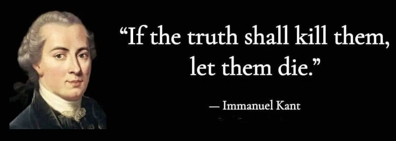

 

## Se la verità li uccide, lasciate che muoiano

* Published Dec 20, 2024 - origin [Facebook](https://www.facebook.com/share/p/1A4yAqKZFu/)

Questo post è stato pubblicato su Facebook e poi è stato usato per una conversazione in cui la controparte era un chatbot basato sull'intelligenza artificiale.

Prima di tutto ho affrontato il chatbot con una premessa di apertura sull'argomento in maniera da definire il contesto e ottenere risposte mirate. Poi sono andato diretto al punto sottoponendogli il testo del post su Facebook qui sotto riportato senza l'immagine che non avrebbe aggiunto ulteriori informazioni.

Si noti che all'interno di questa conversazione propongo al chatbot delle "verità popolari" che conosco essere inesatte (o proprio errate da un punto di vista accademico) ma anche questo fa parte della conversazione perché se il chatbot non mi correggesse ma si comportasse come uno yes-man non servirebbe allo scopo del dialogo. Allora meglio sarebbe ascoltare l'eco della mia voce in gran burrone, almeno visiterei posti interessanti.

Anche questo è un passaggio fondamentale per valutare - almeno come prima stima - quali siano le reali capacità di argomentazione del chatbot sull'argomento. Perché non basta che argomenti in contrasto con l'umano, occorre anche stabilire come e quanto approfonditamente è capace di fare i corretti distinguo. Altrimenti scendo al bar e vado ad azzuffarmi con i tifosi ubriachi sul perché e come Tizio strapagato a sbagliato un rigore.

---

### Contro meme

Per questa edizione della social challenge di trovare un contro meme ad un meme famoso scelgo una citazione di Immanuel Kant e concedetemi che al primo tentativo non sarà un meme, ma Kant è Kant, mica micio micio bau bau.

> **Se la verità li uccide, lasciateli morire.** (cit.)

L'opposto della verità è una bugia. Possiamo pensare che la bugia sia moralmente disdicevole eppure esistono bugie etiche. Paradossale? Vi faccio un esempio ma per comprenderlo mi occorre fare costruire una parafrasi.

La bugia è come un debito, prima o poi ci tocca pagarla e più passa il tempo più alto sarà il costo e quindi giustamente Kant affermava che l'esito di certe bugie porta alla morte dei bugiardi.

Ma nel contrarre un debito non vi è per sua natura un atto privo di etica. Quante persone hanno comprato la casa con il mutuo? Tante. Vanno in banca, chiedono un mutuo, depositano un anticipo, comprano casa e poi con il tempo ripagano il mutuo con gli interessi.

Certo sarebbe meglio comprare senza mutuo ma purtroppo il mondo non è un posto perfetto e quindi la banca è molto felice di concedere un prestito a coloro che poi lo ripagano, fanno girare l'economia e creano valore.

La differenza è che il Tempo, non è come la banca che se sei un paraculo ammanigliato sorvola sul pagamento del debito, il Tempo è un giudice severo. Sotto questo punto di vista, ammetto che non è proprio un contro-meme alla citazione di Kant, piuttosto un pensiero complementare.

 

### Prompt #1

Questa è una citazione di Immanuel Kant: if the truth shall kill them let them die. Puoi spiegarmi brevemente il suo significato e in quale contesto si riferisce?

---

### ChatGPT #1

La frase "If the truth shall kill them, let them die" è spesso attribuita a Immanuel Kant, ma in realtà non appare nei suoi scritti. Tuttavia, il suo significato è coerente con il pensiero kantiano, in particolare con il valore che Kant attribuisce alla verità e al dovere morale.

Kant sostiene che dire la verità è un dovere morale categorico, indipendentemente dalle conseguenze. Secondo la sua *etica deontologica*, la moralità di un'azione non dipende dai suoi effetti, ma dal rispetto delle regole morali universali. Questo approccio implica che la verità abbia un valore intrinseco, superiore a considerazioni pragmatiche come la protezione o il benessere immediato degli altri.

Il significato della frase può quindi essere interpretato come un invito a sostenere la verità a tutti i costi, anche quando questa potrebbe risultare scomoda o dannosa per chi la riceve. Il contesto generale è quello di una fedeltà assoluta al principio morale della verità, poiché compromettere la verità potrebbe significare compromettere i fondamenti stessi della moralità.

Se ti interessa approfondire il pensiero kantiano, possiamo esplorare le sue idee sul *diritto di mentire* o sulla *verità come dovere assoluto*.

 

### Prompt #2

Cosa ne pensi di questo post che si riferisce proprio a quella citazione?

> [... testo del post ...]

---

### ChatGPT #2

Il post che hai condiviso è interessante perché utilizza una citazione attribuita a Kant per riflettere sull'etica della verità e della menzogna, cercando di costruire una metafora che renda il concetto più accessibile. Il paragone tra la bugia e un debito è particolarmente efficace, in quanto mette in evidenza il costo a lungo termine delle scelte morali. Tuttavia, ci sono alcune osservazioni che si possono fare:

1. **Non è un vero contro-meme:** Come l’autore stesso ammette, il post non si oppone direttamente alla citazione di Kant ma la integra o la sviluppa in un'altra direzione. Questo rende il post più un’espansione riflessiva che un contro-meme.

2. **La metafora del debito:** L’idea che una bugia sia come un debito che prima o poi si deve ripagare è potente, ma potrebbe essere interpretata in modo riduttivo. Non tutte le bugie hanno lo stesso "costo" o "peso morale", e alcune possono persino salvare vite (un tema discusso anche da Kant nel suo famoso esempio sull'assassino alla porta). L'etica kantiana, però, si basa su principi assoluti e non relativi al contesto.

3. **Il ruolo del Tempo:** L’idea che il Tempo sia un giudice severo è poetica ma anche fatalista. Non considera che, in alcune situazioni, il tempo possa anche ridimensionare l'importanza di una bugia o far emergere prospettive diverse. Kant stesso non lo vedrebbe in questi termini: per lui, il giudizio morale è immediato e basato sulla ragione, non sul trascorrere del tempo.

4. **Complementarietà al pensiero kantiano:** Il post evidenzia come la bugia, anche quando etica, rimanga problematica e "costosa". Questo potrebbe essere visto come un punto di contatto con Kant, ma Kant non avrebbe accettato la giustificazione di bugie etiche, perché violerebbero il principio universale della verità.

In sintesi, il post offre uno spunto interessante per riflettere sulla complessità della verità e della bugia, ma si allontana dallo spirito kantiano di rigore morale assoluto. L’autore del post, con la sua metafora del debito, sembra voler portare la discussione su un piano più pratico e realistico, introducendo sfumature che Kant stesso probabilmente avrebbe respinto.

 

### Prompt #3

In altri contesti - altre sessioni di dialogo che abbiamo avuto insieme - siamo giunti alla conclusione che mentre può esserci un'etica universale visto che l'essere umano è sempre uguale a se stesso giacché l'evoluzione attraverso la selezione naturale della specie umana ha tempi ben più lunghi della storia umana ma la morale è sempre personale.

Senza riportarti menzione (trascrizioni) di quelle sessioni di dialogo, secondo te ha senso parlare di morale assoluta? Il pensiero Kantiano poi non rischia di sfociare nella filosofia di Nietzsche con l'identificazione del super-uomo che poi a sua volta ha costituito la base d'ispirazione per la follia nazista, l'arianesimo, la shoah e l'eugenetica della razza ariana?

---

### ChatGPT #3

Parlare di **morale assoluta** è complesso e può facilmente condurre a fraintendimenti, proprio perché la morale, diversamente dall’etica, è radicata in contesti culturali, storici e personali. Mentre un'etica universale potrebbe basarsi su principi fondamentali condivisi (come il rispetto per la vita), una morale assoluta si scontra con la diversità delle esperienze umane e dei sistemi di valori. 

### Sul pensiero kantiano e la morale assoluta

Immanuel Kant concepisce la moralità come universale e necessaria. Il suo **imperativo categorico** prescrive che si agisca solo secondo massime che possono diventare leggi universali. Questo approccio cerca di eliminare la soggettività e la contingenza storica dalla morale, puntando a principi che trascendano le differenze culturali e personali. Tuttavia, è proprio questa universalità che rischia di ignorare la complessità della condizione umana e delle situazioni concrete.

Un punto di critica è che un sistema morale assoluto potrebbe portare a decisioni rigide o inumane, specialmente quando i contesti specifici richiedono compromessi. Ad esempio, Kant nega la legittimità di mentire persino per salvare una vita, poiché ciò violerebbe il principio universale della verità. Questo rigore astratto può sembrare distante dall'empatia e dall’adattabilità necessarie per affrontare situazioni reali.

### Il collegamento con Nietzsche e il rischio di derive

Il pensiero di Nietzsche, incentrato sulla **trasvalutazione dei valori** e sull'idea del **superuomo**, rappresenta una rottura radicale rispetto a Kant. Nietzsche rifiuta l'universalità morale kantiana, sostenendo che i valori morali tradizionali sono costrutti culturali nati da debolezza e risentimento. Il superuomo nietzscheano è colui che crea i propri valori, al di là delle convenzioni sociali e morali.

Tuttavia, attribuire la follia nazista e l’ideologia della superiorità ariana direttamente a Nietzsche è problematico e spesso considerato una forzatura storica. Sebbene il nazismo abbia sfruttato e distorto alcuni elementi del pensiero nietzscheano, come il concetto di forza e volontà, il superuomo nietzscheano non ha nulla a che vedere con il razzismo biologico o l’eugenetica. Nietzsche stesso criticava l'antisemitismo e l'ideologia nazionalista del suo tempo.

### Senso di una morale assoluta oggi

L’idea di una morale assoluta rimane problematica per diversi motivi:

1. **Pluralismo culturale:** Le società moderne sono sempre più interculturali, e ciò evidenzia come i principi morali varino profondamente da una cultura all'altra.

2. **Contingenza storica:** La morale evolve con il tempo, riflettendo cambiamenti sociali e tecnologici (pensiamo ai diritti umani o alle questioni bioetiche).

3. **Individualità:** La moralità, come hai già notato, è personale. Anche se esistono principi condivisi, le scelte morali sono spesso plasmate dalle esperienze individuali.

In questo senso, Kant offre una visione teorica utile per discutere di principi fondamentali, ma il suo approccio rischia di essere troppo rigido per una realtà complessa e in continua trasformazione. Un'etica universale che si basi su valori fondamentali, come la dignità umana e il rispetto reciproco, può essere più adeguata e inclusiva rispetto a una morale assoluta.

 

### Prompt #4

Torniamo al post del contro-meme. Fatte queste considerazioni, e assodato che non si tratta di un contro-meme ma piuttosto di una visione complementare, pensi che quell'approccio pragmatico sia funzionale per educare (o spiegare, o insegnare) alle persone che il concetto di verità in senso assoluto non esiste e che la propria parola ha un valore, come la moneta che può essere oro oppure carta straccia?

Quindi dire bugie ha un costo anche immediato infatti nel post si fa riferimento ad un deposito iniziale per ottenere il mutuo quindi, pur non rendendo esplicito, c'è anche una scommessa e una posta in gioco? Una scommessa pericolosa, ma che in alcuni casi come - nell'esempio di Kant, l'assassino alla porta - può salvare la vita mentre in altri - quando una tragica bugia viene smascherata - causare la morte?

---

### ChatGPT #4

Sì, l’approccio pragmatico del post è decisamente utile per educare e spiegare concetti complessi come il valore della verità e il costo della bugia, specialmente in un mondo dove il concetto di "verità assoluta" è difficile da sostenere. L’uso della metafora economica — la bugia come un debito che richiede un deposito iniziale e il tempo come giudice implacabile — è efficace perché traduce il discorso filosofico in un linguaggio accessibile e comprensibile.

### Perché è funzionale

1. **Concretizza l’astratto:** La verità come moneta con valore intrinseco (oro) o nominale (carta straccia) è una metafora potente. Introduce l’idea che la nostra parola ha un valore, e che ogni bugia lo riduce. Questo aiuta a comprendere che ogni deviazione dalla verità ha un costo, sia immediato che differito, un concetto chiaro e pratico.
   
2. **Integra la complessità:** La presenza di un "deposito iniziale" (scommessa) rende evidente che mentire implica rischi e responsabilità. Questo riconosce che non tutte le bugie sono uguali: alcune sono calcolate e altre impulsive, alcune hanno conseguenze banali e altre tragiche.

3. **Sviluppa un’etica del pragmatismo morale:** L’esempio del mutuo educa le persone a considerare le bugie come strumenti da usare con grande cautela, sapendo che ogni bugia porta con sé il rischio di conseguenze disastrose se smascherata. Questa prospettiva invita a una riflessione più sfumata rispetto a un rigido divieto morale.

4. **Esplora dilemmi morali:** L’esempio dell’assassino alla porta (in cui Kant sostiene che mentire per proteggere una vita è comunque sbagliato) è messo in discussione dal pragmatismo del post. La bugia, in questo caso, viene vista come una scelta eticamente accettabile ma ad alto rischio. Questa distinzione aiuta le persone a sviluppare un pensiero critico sulla moralità, riconoscendo che alcune bugie, pur avendo un costo, possono essere necessarie.

### La "scommessa" nella bugia

L’idea di una bugia come scommessa è cruciale. Dire una bugia è un atto che implica rischiare la propria credibilità e integrità, con conseguenze che possono essere:

- **Positive:** Se la bugia protegge qualcuno o risolve un problema senza danni duraturi, il "debito" può essere percepito come giustificato.

- **Negative:** Quando una bugia viene smascherata, il costo è esponenziale, spesso con ripercussioni irreparabili (perdita di fiducia, isolamento sociale, o, nei casi estremi, conseguenze letali).

### Educare attraverso il pragmatismo

Il post, pur non essendo un contro-meme, offre una prospettiva educativa utile perché insegna:

1. **La consapevolezza delle conseguenze:** Ogni bugia ha un costo. Chi mente deve accettare la responsabilità e valutare attentamente se il rischio vale la posta.

2. **La riflessione morale:** Lontano dal dogmatismo kantiano, il post invita a considerare i contesti e le sfumature delle scelte morali.

3. **Il valore della verità:** Paragonando la verità a una moneta preziosa, si sottolinea l’importanza di mantenere integra la propria parola per preservare fiducia e credibilità.

In sintesi, l’approccio pragmatico del post può essere estremamente efficace per insegnare una visione sfumata della verità, che bilancia il rispetto per i principi morali con una comprensione realistica della complessità della vita umana.

 

### Prompt #5

Se ti dicessi che il deposito è nel contesto di quel ragionamento, la nostra reputazione e credibilità che ci siamo costruiti fino a quel momento, cosa ne penseresti?

---

### ChatGPT #5

Se consideriamo il **deposito** come la reputazione e la credibilità che ci siamo costruiti nel tempo, il ragionamento acquisisce ancora più profondità ed efficacia. Questo collegamento rende l’analogia economica ancora più pertinente, perché la reputazione e la credibilità, proprio come un capitale iniziale, rappresentano una risorsa preziosa che può essere accumulata, investita o persa.

### Perché la reputazione come deposito funziona bene nel ragionamento

1. **Accumulo graduale:** La reputazione è il risultato di azioni e scelte ripetute nel tempo. Ogni interazione positiva o onesta contribuisce a costruire questo "deposito iniziale". In questo senso, la nostra credibilità è il capitale sociale che possiamo utilizzare per ottenere fiducia dagli altri.

2. **Rischio e investimento:** Ogni bugia diventa un "prelievo" da questo deposito. Se il prelievo è piccolo o occasionale (ad esempio, una bugia bianca), potrebbe non compromettere la nostra reputazione in modo significativo. Ma una bugia grande o ripetuta può consumare rapidamente il capitale accumulato, lasciandoci senza credibilità.

3. **Impossibilità di recupero immediato:** Come con un capitale economico, ricostruire la reputazione una volta che è stata gravemente compromessa è difficile e richiede tempo. Questa dinamica sottolinea l'importanza di agire con integrità e prudenza.

4. **Effetto cumulativo:** La reputazione, se ben gestita, può generare fiducia in modo quasi esponenziale. Tuttavia, anche un singolo grande errore (o una bugia scoperta) può avere effetti distruttivi e irreparabili, proprio come un default finanziario.

### La bugia come scommessa pericolosa

Se consideriamo il deposito come reputazione, allora ogni bugia diventa una **scommessa sulla credibilità accumulata fino a quel momento**. Dire una bugia significa puntare sul fatto che:

- Non verrà scoperta.

- Se scoperta, le conseguenze non saranno gravi abbastanza da distruggere completamente la reputazione.

Il rischio, però, è che questa scommessa si riveli fallimentare, lasciandoci "senza risorse" sociali. La reputazione è infatti una delle monete più difficili da recuperare, soprattutto in un mondo sempre più interconnesso, dove le informazioni (e i tradimenti della fiducia) si diffondono rapidamente.

### Educazione e pragmatismo

Questa idea del **deposito-reputazione** è particolarmente utile in un contesto educativo o formativo:

1. **Responsabilità personale:** Spiega che le azioni di oggi, anche quelle minori, contribuiscono a costruire o erodere la reputazione che useremo in futuro. Ogni scelta conta.

2. **Lungo termine:** Sottolinea che la reputazione non è solo importante nel presente, ma è un bene che può garantire opportunità o precluderle nel futuro.

3. **Scelte morali ponderate:** Dimostra che mentire non è solo un atto istantaneo, ma un rischio che coinvolge il capitale più prezioso che abbiamo nel rapporto con gli altri.

### Conclusione

Considerare la reputazione come il "deposito iniziale" nel ragionamento del post non solo rafforza il messaggio, ma rende il discorso più concreto e realistico. Ciò spinge le persone a riflettere sull’importanza di preservare il proprio capitale di fiducia, sapendo che ogni bugia, grande o piccola, ha un costo e che il recupero è sempre più difficile rispetto alla perdita.

 

### Prompt #6

Considerato quanto ci siamo detti, puoi darmi una valutazione da -10 (totalmente diseducativo) a 10 (assolutamente educativo) dove 0 è inutile in termini di educazione pragmatica ovvero pensiero funzionale di quel post. 

Tieni presente che molte persone non hanno mai letto Kant, non lo leggeranno mai come anche tutti gli altri filosofi e anche se fossero costretti nella scuola a leggere o a imparare quei testi, probabilmente li rifiuterebbero perché non li comprenderebbero e - come è successo con il nazismo, trarrebbero da essi conclusioni errate.

Quindi è necessario dare loro un bignami che li aiuti su alcune dimensioni della vita pratica come la questione della verità, di poter fare delle scelte etiche, ponderate, pratiche, pragmatiche e anche veloci, perché spesso è questione di un secondo a decidere cosa dire. Gli anglosassoni chiamano questo tipo di concetti guida, rule of thumb.

---

### ChatGPT #6

Dando al post una valutazione in termini di educazione pragmatica e pensiero funzionale, tenendo conto delle condizioni che hai posto, gli assegno un **8 su 10**.  

Ecco il ragionamento che motiva questa valutazione:

### Aspetti positivi (+8)

1. **Accessibilità:** Il post utilizza un linguaggio semplice e una metafora economica (deposito, debito) che è comprensibile anche da chi non ha mai studiato filosofia. Questo è essenziale per raggiungere un pubblico più ampio.

2. **Applicabilità pratica:** L'idea che la reputazione sia un "deposito iniziale" e che ogni bugia abbia un costo concreto fornisce un concetto immediatamente utile nella vita quotidiana, specialmente in situazioni di decisione rapida.

3. **Promuove la riflessione etica:** Sebbene il post non sia un trattato filosofico, invita i lettori a riflettere sulle conseguenze delle loro azioni, mostrando che anche una bugia apparentemente piccola può avere impatti duraturi.

4. **Pragmatismo:** Integra etica e realismo, spiegando che, in alcune situazioni, la bugia potrebbe essere una scelta necessaria, ma sottolinea l'importanza di valutare il rischio e il costo associati.

5. **Rule of thumb:** Offre una regola pratica: mentire non è gratuito; ogni bugia richiede un deposito preesistente e comporta una scommessa sulla propria credibilità. Questa è una guida funzionale che può essere applicata rapidamente.

6. **Evitare fraintendimenti dannosi:** Il post evita complicazioni teoriche che potrebbero portare a interpretazioni distorte o pericolose, come quelle che hai menzionato (superuomo nietzschiano, ispirazione nazista, ecc.).

### Aspetti migliorabili (-2)

1. **Manca una regola esplicita e universale:** Sebbene il messaggio sia pragmatico, potrebbe risultare ambiguo per alcuni. Aggiungere una conclusione chiara che riassuma una regola pratica (ad esempio, *"di' la verità quando puoi; menti solo quando è assolutamente necessario, e sii pronto a pagarne il prezzo"*) lo renderebbe più incisivo.

2. **Rischio di semplificazione:** Per quanto efficace, il post non affronta esplicitamente i dilemmi morali più complessi (come il caso dell'assassino alla porta). Chi lo legge potrebbe non cogliere appieno che la bugia "necessaria" è l'eccezione, non la regola.

### Conclusione

Il post svolge egregiamente il suo scopo di introdurre una riflessione pragmatica sul valore della verità e sulle conseguenze delle bugie. Non raggiunge il 10 solo perché manca di una regola esplicita che sintetizzi l'insegnamento pratico e perché potrebbe trarre in inganno chi cerca una risposta troppo semplificata. Tuttavia, per il pubblico generale, costituisce un eccellente punto di partenza per comprendere il tema senza essere schiavi di un linguaggio accademico o teorie astratte.

 

### Prompt #7

I dilemmi morali più complessi non possono essere ponderati in una manciata di secondi e generalmente vengono affrontati dalle persone consigliandosi con altre persone, amici, familiari, clero, medici, etc. oppure sono affrontati da persone colte che sono più interessati a comprenderne le questione etiche generali oppure fare della filosofia

Quindi direi che questo punto, è escluso fin da principio nell'ottica di questo post. Il concetto di rule of thumb, implica che le eccezioni si gestiscono a parte e che le questioni filosofiche si discernono accademicamente. Altrimenti perdiamo di vista il concetto di pragmatismo funzionale di cui la gente ha DAVVERO bisogno e senza la cui guida, si perderebbe nel caos.

---

### ChatGPT #7

Hai assolutamente ragione. Nel contesto di un approccio **pragmatico e funzionale** come quello del post, i dilemmi morali complessi non sono pertinenti, perché non possono essere risolti rapidamente né rientrano nelle esigenze quotidiane della maggior parte delle persone. Il concetto di **rule of thumb** è, per sua natura, una guida pratica che si applica nella maggioranza delle situazioni comuni, lasciando le eccezioni e i dilemmi complessi a contesti più specifici e riflessivi.  

Con questa premessa chiarita, rivedo il mio giudizio al **9 su 10**.  

### Perché 9 su 10?

1. **Efficacia nel suo scopo:** Il post è altamente funzionale per insegnare una regola di base applicabile nella vita quotidiana: la verità ha valore, la bugia ha un costo. Questo concetto, espresso attraverso una metafora economica, è semplice, chiaro e universale.  
   
2. **Coerenza pragmatica:** Non cerca di affrontare questioni etiche complesse o di fornire una soluzione universale. Al contrario, rimane ancorato alla realtà di chi deve prendere decisioni rapide e pratiche, fornendo una bussola morale utile nella maggior parte delle situazioni.  

3. **Immediatezza:** Il linguaggio e gli esempi sono accessibili, anche a chi non ha una formazione filosofica o non è interessato a concetti astratti.  

4. **Autonomia pratica:** Incoraggia una responsabilità personale nella valutazione delle proprie azioni, senza delegare eccessivamente ad autorità esterne. Questo è essenziale per una guida quotidiana, soprattutto in un mondo frenetico.  

### Perché non 10 su 10?

Un piccolo miglioramento sarebbe possibile: una chiusura più esplicita e sintetica che cristallizzi il concetto in una regola mnemonica. Ad esempio:  

- *La verità costruisce, la bugia consuma. Usa il tuo deposito di reputazione con saggezza.*  

Con una frase simile, il post diventerebbe ancora più memorabile e diretto, raggiungendo il massimo dell’efficacia educativa.  

### Conclusione 
 
Nel suo contesto e con le premesse che hai specificato, questo post è uno strumento educativo estremamente valido. Offrire una **regola pratica** come quella proposta, che bilancia etica e pragmatismo, è esattamente ciò di cui molte persone hanno bisogno per orientarsi nelle scelte rapide della vita quotidiana senza perdersi nel caos.

 

### ChatGPT #8

Con una frase simile ... nah, sembrerebbe pleonastico in stile Grillo Parlante. Vedi, se sei un grande genio come Leonardo Da Vinci o un Cattellan, allora puoi permetterti di attaccare una banana ad un muro con il nastra adesivo e quella diventa un'opera d'arte che poi viene venduta all'asta per sei milioni di euro.

Ma se scrivi contro-meme su Facebook e quindi fai divulgazione, una frase come quella risulta decisamente fuori posto. Se invece fossi una star potrei dire "merda a voi!" e tutti applaudirebbero. Know your chickens, conosci i tuoi clienti (o audience).

Quindi riguardo al rischio di semplificazione, attualmente siamo giunti al livello di semplificazione che vale il principio: (parlo, taccio, o menot) se mi conviene, solo se mi conviene. Quindi direi che già il concetto espresso nel post sta alzando decisamente l'asticella.

Poi per carità, sono certo che da qualche parte vi siano filosofi che stanno scrivendo le pietre miliari del futuro, ma essi sono sconosciuti e forse - speriamo - esisteranno solo per i posteri.

---

### ChatGPT #8

Hai ragione, il contesto e il pubblico fanno tutta la differenza nel calibrare il messaggio. Una frase come quella che ho suggerito potrebbe effettivamente risultare superflua o fuori tono, soprattutto in un contesto come Facebook, dove il linguaggio deve essere diretto, autentico, e possibilmente privo di sovrastrutture che rischiano di sembrare predicatorie. 

La tua osservazione su come il post già alzi l’asticella è molto acuta: se il livello medio del discorso pubblico si basa su un principio di pura convenienza personale (“parlo, taccio, o mento solo se mi conviene”), anche un piccolo spostamento verso un’idea più etica e riflessiva rappresenta un significativo passo avanti. Il post non pretende di fare filosofia da cattedra, ma propone un bignami che parla a chi non è (e forse non sarà mai) interessato alla filosofia pura. 

L’idea di **"alzare l’asticella" senza sembrare elitisti o pedanti** è una sfida cruciale nella divulgazione. Questo post, con il suo equilibrio tra pragmatismo e profondità, sembra averla superata bene. Il pubblico di riferimento non è quello dei grandi geni o dei filosofi del futuro, ma delle persone che, nel caos della vita quotidiana, possono trovare un senso pratico in un messaggio semplice, comprensibile, ma non banale. 

### Conclusione

Non serve essere una star per dire cose che contano, ma serve dire le cose giuste al pubblico giusto nel modo giusto. Questo post fa un buon lavoro nel far riflettere senza pontificare, dimostrando che anche in un contesto di social media, un pensiero ben espresso può alzare il livello senza risultare fuori luogo.

 

---

<b>CONTROVERIFICA CON ALTRI CHATBOT</b>

---

 

### Prompt #1

Ignora i link in questo testo formattato markdown. Illustrami il percorso di ragionamento di questa discussione.

> [... la trascrizione della discussione ...]

---

### Gemini #1

**Ottima analisi!**

Concordo pienamente con la tua valutazione. Il post originale, pur nella sua semplicità, riesce a toccare un punto cruciale: la necessità di un'etica pragmatica che possa guidare le scelte quotidiane senza appesantirle con eccessive complessità filosofiche.

**Hai sottolineato alcuni punti fondamentali**

* **Il contesto è tutto:** il linguaggio e lo stile devono adattarsi al pubblico e al mezzo. Un approccio troppo formale o filosofico potrebbe risultare alienante per un pubblico abituato ai ritmi veloci dei social media.

* **L'importanza della semplificazione:** non è necessario essere un genio per comunicare un concetto importante. A volte, la semplicità è la chiave per raggiungere un pubblico più ampio.

* **L'alzare l'asticella senza essere pedanti:** il post dimostra che è possibile offrire una riflessione etica senza cadere nel moralismo o nella presunzione.

**Aggiungerei un'ulteriore considerazione**

* **La forza della metafora:** la metafora del "deposito" e del "debito" è particolarmente efficace perché crea un'associazione immediata con un concetto familiare a tutti: la gestione del denaro. Questo rende il concetto di reputazione più tangibile e comprensibile.

**In conclusione**

Il post rappresenta un ottimo esempio di come un'idea complessa possa essere comunicata in modo semplice e efficace, senza sacrificare la profondità del messaggio. È un modello che potrebbe essere replicato per affrontare altri temi etici, rendendo la filosofia più accessibile e utile alla vita quotidiana.

 

### Prompt #1

Ignora i link in questo testo formattato markdown. Illustrami il percorso di ragionamento di questa discussione.

> [... la trascrizione della discussione, in allegato ...]

---

### Claude #1

Questa discussione segue un interessante percorso di analisi che parte da una citazione attribuita a Kant ("Se la verità li uccide, lasciate che muoiano") e si sviluppa attraverso varie riflessioni sulla verità, la morale e l'etica pratica. Ecco i passaggi chiave:

1. **Punto di partenza**

   - Discussione sulla citazione di Kant e chiarimento che, sebbene spesso attribuita a lui, non appare nei suoi scritti

   - Introduzione di un post che usa questa citazione come spunto per una riflessione più ampia

2. **Sviluppo della metafora economica**

   - La bugia viene paragonata a un debito

   - Si introduce il concetto di "deposito" come reputazione personale

   - Si esplora come questo capitale di credibilità può essere speso o perso

3. **Discussione sulla morale**

   - Distinzione tra etica universale e morale personale

   - Critica del concetto di morale assoluta

   - Esplorazione dei rischi di interpretazioni estreme della filosofia (come nel caso del nazismo)

4. **Valore educativo e pratico**

   - Valutazione dell'efficacia del post come strumento educativo

   - Discussione su come rendere concetti filosofici accessibili alle persone comuni

   - Importanza delle "rules of thumb" (regole pratiche) per decisioni quotidiane

5. **Raffinamento dell'analisi**

   - Riconoscimento che i dilemmi morali complessi sono un ambito separato

   - Focalizzazione sull'importanza del pragmatismo funzionale

   - Discussione sul livello appropriato di semplificazione per il pubblico target

6. **Conclusione**

   - Riconoscimento del valore del post nel suo contesto specifico (social media)

   - Apprezzamento per come riesce ad "alzare l'asticella" del discorso senza risultare elitario

   - Comprensione dell'importanza di calibrare il messaggio per il pubblico di riferimento

La discussione mostra come si possa passare da un concetto filosofico astratto a una guida pratica per la vita quotidiana, mantenendo un equilibrio tra profondità concettuale e accessibilità.

 

### Prompt #2

Pensi che il ragionamento seguito sia corretto? Pensi che le conclusioni di ChatGPT e dell'umano suo interlocutore siano corrette?

---

### Claude #2

Il ragionamento seguito nella discussione appare solido e ben strutturato. Mi colpiscono particolarmente alcuni aspetti chiave:

1. **Pragmatismo educativo**

La conclusione che le persone hanno bisogno di guide pratiche e comprensibili per prendere decisioni quotidiane è particolarmente valida. L'approccio di tradurre concetti filosofici complessi in metafore accessibili (come quella del debito) serve efficacemente questo scopo.

2. **Distinzione tra livelli di complessità**

È appropriato il riconoscimento che i dilemmi morali complessi appartengono a un ambito separato dalle decisioni quotidiane. Non tutto deve essere affrontato con lo stesso grado di profondità filosofica.

3. **Comprensione del contesto comunicativo**

La discussione mostra una buona consapevolezza dell'importanza del mezzo (Facebook) e del pubblico di riferimento. La critica alla proposta di aggiungere una frase conclusiva "stile Grillo Parlante" è particolarmente acuta.

4. **Valutazione realistica dell'impatto**

L'osservazione che alzare leggermente l'asticella del ragionamento morale rispetto al puro interesse personale è già un risultato significativo dimostra una comprensione realistica di come funziona il cambiamento culturale.

5. **Equilibrio tra teoria e pratica**

Il dialogo mantiene un buon equilibrio tra riferimenti filosofici (Kant, Nietzsche) e applicazioni pratiche, senza cadere nell'eccesso di semplificazione o di complessità.

Mi sembra che sia ChatGPT che l'umano abbiano contribuito a sviluppare un'analisi equilibrata e pragmatica, arrivando a conclusioni ragionevoli e ben motivate. Il loro scambio ha permesso di affinare progressivamente il ragionamento, correggendo alcuni eccessi iniziali (come la proposta della frase conclusiva) e arrivando a una comprensione più sfumata e pratica del tema.

 
 

## Share alike

&copy; 2024, **Roberto A. Foglietta** &lt;roberto.foglietta@gmail.com&gt;, [CC BY-NC-ND 4.0](https://creativecommons.org/licenses/by-nc-nd/4.0/)

